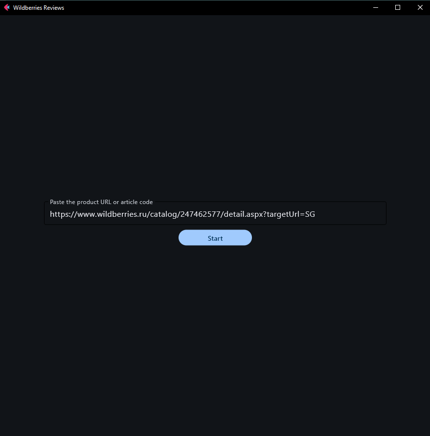
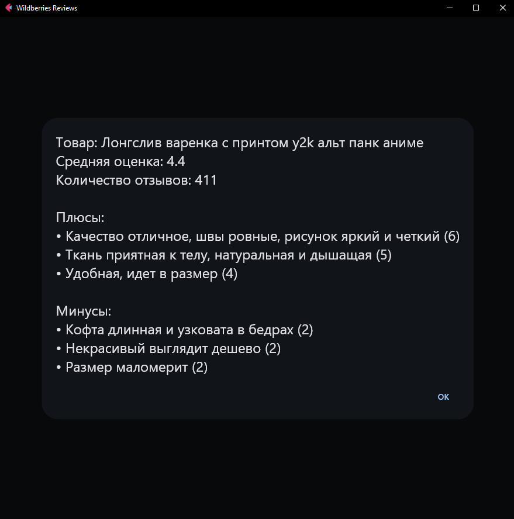

# WB Review Parser
[](https://github.com/psf/black)

The project is inspired by the content of the YouTube channel [The ParseHub](https://www.youtube.com/@the_parse_hub)


## Description

WB Review Parser — analyzer of positive and negative reviews of Wildberries products by SKU. The SKU is the main product identifier in Wildberries, which is used, for example, in the address of the product card: https://www.wildberries.ru/catalog/64245978/detail.aspx

Below is an example:

<div style="display: flex; justify-content: center; align-items: center;">
    
    
</div>

## Project content

- parsing reviews from Wildberries
- integration with ChatGPT for processing reviews
- adding a cross-platform graphical interface

## Getting Started

### Installing

1. Clone the repository:
```
git clone https://github.com/YuryHerasimau/wildberries_parser.git
```
2. Install the required dependencies:
```
pip install -r requirements.txt
```
3. Сreate a `.env` file in the root directory with your OPENAI_API_KEY

### Usage
1. `Executing the Program`
To run the application as a desktop app, use the following command:
```
flet run src/main.py
```
To run the application as a web app, use the following command:
```
flet run src/main.py --web --port 8000
```
2. `Compilation`
To compile the entire program into an executable file, run the following command:
```
python -m nuitka --follow-imports --standalone --jobs=4 --onefile --windows-console-mode=disable --include-package-data=flet main.py
```
3. `Testing:`
To run the tests, execute the following command:
```
python -m unittest tests/test_wb_parser.py
```

## What can be improved
- [x] Add the product name to the UI, as well as other data such as average rating and number of reviews
- [x] Compile the entire program into an exe file
- [x] Cover the code with tests
